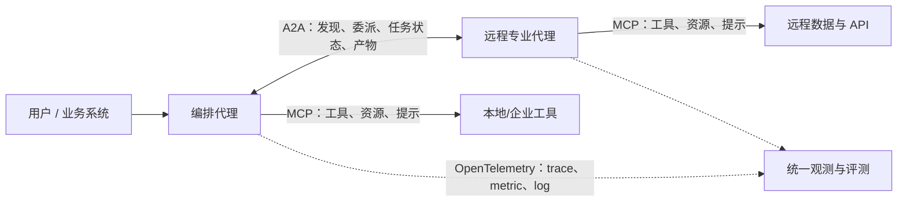
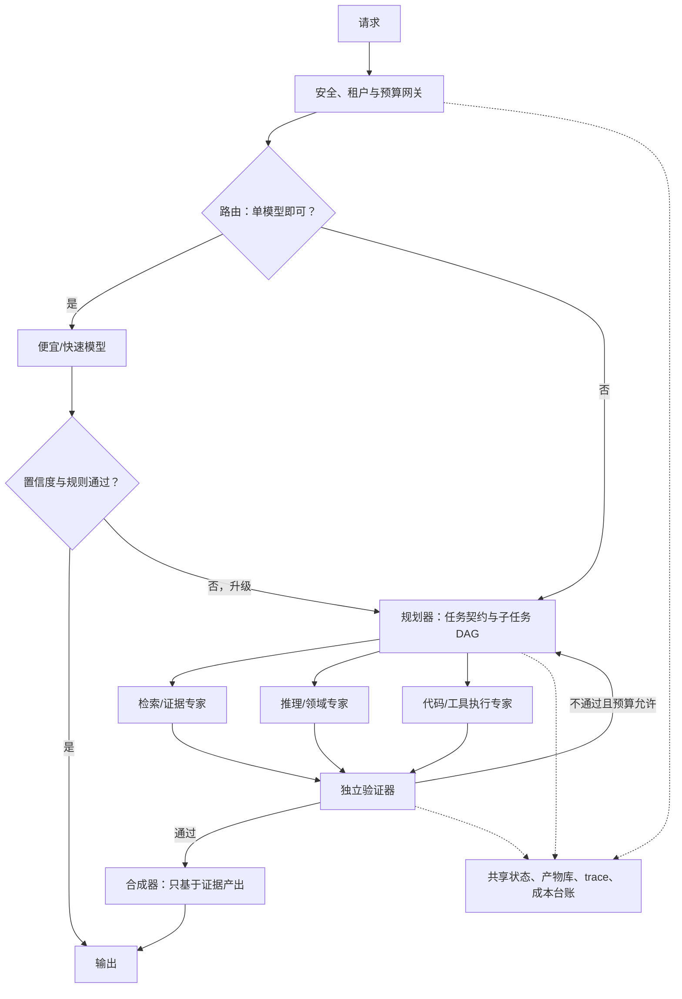

# 多模型协作 SOTA 综述：文献、开源项目与产业生态

> 截止日期：2026-08-19
>
> 所属项目：AIData
>
> 口径说明：本文将原需求中的“总数”按“综述”理解。“多模型协作”指多个模型实例或异构模型通过路由、级联、并行集成、辩论、角色分工、动态编排或跨系统协议共同完成推理与行动。文中项目数量是按明确口径抽取的代表性样本，不等同于整个生态的项目总量。

## 一、结论先行

1. **不存在脱离任务、成本与时延约束的单一“多模型协作 SOTA”。** 当前领先方案按目标分化：成本—质量前沿由学习型路由/级联主导；单题极限质量常由高质量候选的并行采样与生成式融合主导；长程工具任务更适合“确定性工作流骨架 + 动态专家调用 + 独立验证器”。
2. **“多模型”并不天然优于“一个强模型多次采样”。** 2025 年 Self-MoA 工作显示，候选的平均质量往往比模型品牌多样性更重要；把弱模型无筛选地混入系统可能拉低最终结果。真正有价值的是**互补能力、独立证据和受控分歧**，而不是代理数量本身。
3. **生产系统正在从固定群聊转向预算感知的动态编排。** 领先设计只在任务需要时激活专家，采用稀疏通信、结构化中间产物、可验证终止条件和故障恢复，避免所有代理互看全部上下文。
4. **协议层已经分工清楚。** MCP 解决“模型/代理如何使用工具与数据”；A2A 解决“独立代理如何发现、委派和协作”。截至本文日期，A2A 最新发布规范为 1.0；MCP 已捐赠给 Linux Foundation 旗下 Agentic AI Foundation。
5. **开源框架选型已经换代。** 微软 AutoGen 已进入维护模式，新项目应看 Microsoft Agent Framework；Google ADK、OpenAI Agents SDK、LangGraph、CrewAI、AgentScope 仍活跃。AWS 原 Bedrock Agents 已标为 Classic，并于 2026-07-30 起不再向新客户开放，生产新系统应评估 AgentCore。
6. **建议的默认架构不是“代理群聊”，而是**：轻量路由器 → 规划器 → 2–4 个按需并行专家 → 基于证据的验证器 → 单一合成器；所有节点受统一预算、追踪、权限和结构化状态约束。

## 二、问题定义与技术谱系

| 范式 | 协作方式 | 主要收益 | 主要代价/风险 | 代表工作 |
|---|---|---|---|---|
| 路由（routing） | 每个请求只选一个最合适模型 | 低成本、低时延、易上线 | 路由漂移、冷启动、误把难题送给弱模型 | FrugalGPT、RouteLLM、RouterBench |
| 级联（cascade） | 便宜模型先答，不确定时升级 | 可控成本、自然故障回退 | 置信度需要校准，错误可能未触发升级 | FrugalGPT、Mixture of Thoughts |
| 并行采样与投票 | 同一或多个模型独立作答，再投票 | 简单、稳定、易并行 | 成本近似随样本数线性增长；共因错误 | Agent Forest、自一致性 |
| 排序与融合 | 对多个候选排序，再由合成模型重写 | 开放式生成质量高 | 合成器可能丢证据或受低质候选污染 | LLM-Blender、MoA、Self-MoA |
| 辩论/批判 | 提案者、反方、裁判多轮交互 | 揭示盲点，适合可争辩问题 | 从众、问题漂移、token 爆炸、裁判失误 | Multi-Agent Debate、Sparse MAD |
| 角色化工作流 | 规划、检索、编码、执行、审核分工 | 可解释、可治理、适合长任务 | 角色重叠、上下文传递与终止困难 | MetaGPT、ChatDev、Magentic-One |
| 动态拓扑/编排 | 运行时选择代理、顺序和通信边 | 提升成本效率与适应性 | 训练/评估复杂，调度器成为单点瓶颈 | DyLAN、GPTSwarm、Evolving Orchestration |
| 跨系统代理协作 | 不同框架/组织的代理通过标准协议互操作 | 解耦框架与供应商 | 信任边界扩大，需身份、授权与输入净化 | A2A + MCP |

需要区分三个经常混用的概念：

- **模型路由**：一次请求通常只执行一个模型；本质是选择问题。
- **模型集成**：多个模型/样本都执行，再做选择、投票或融合；本质是推理时算力换质量。
- **多智能体系统（MAS）**：模型被赋予状态、角色、工具和交互协议；本质是任务分解与组织设计。多个代理可以共享同一底座模型，也可以使用异构模型。

## 三、研究前沿：哪些结果真正改变了设计

| 时间 | 工作 | 核心结果 | 对当前设计的意义 | 证据边界 |
|---|---|---|---|---|
| 2023 | [FrugalGPT](https://arxiv.org/abs/2305.05176) | 学习式 LLM 级联在其实验中可匹配最佳单模型并显著降本 | 先做路由/升级策略，再考虑昂贵的全量集成 | 早期模型与价格结构，绝对数字不可直接外推 |
| 2023 | [LLM-Blender](https://arxiv.org/abs/2306.02561) | PairRanker 选择候选，GenFuser 融合优点 | “选择 + 融合”成为后处理集成的基本模板 | 依赖专门训练与候选质量 |
| 2023 | [Multi-Agent Debate](https://arxiv.org/abs/2305.14325) | 多实例辩论改善部分数学、策略推理与事实性任务 | 独立初答后再交叉审查，比一开始共享上下文更合理 | 后续工作表明收益并不普适 |
| 2024 | [More Agents Is All You Need](https://arxiv.org/abs/2402.05120) | 采样—投票随代理数增加出现性能增益 | 为测试时扩展提供简单基线 | 必须用等成本单模型采样作对照 |
| 2024 | [RouteLLM](https://arxiv.org/abs/2406.18665) | 用偏好数据学习强/弱模型路由，部分设置下成本降低超过 2 倍且质量保持 | 路由器应从真实偏好/任务数据学习，而非只靠关键词规则 | 模型替换与分布变化仍需重校准 |
| 2024 | [Mixture-of-Agents](https://arxiv.org/abs/2406.04692) | 分层聚合多个开放模型输出；论文报告 AlpacaEval 2.0 LC 胜率 65.1%，高于当时 GPT-4o 的 57.5% | 生成式聚合能利用候选互补性 | 是特定时期、特定裁判和预算下的结果，不是 2026 通用排名 |
| 2024 | [Sparse Communication Topology](https://arxiv.org/abs/2406.11776) | 稀疏通信可在降低计算量的同时达到相当或更好效果 | 默认避免全连接群聊；只传递必要状态与证据 | 拓扑需随任务验证 |
| 2025 | [Self-MoA](https://arxiv.org/abs/2502.00674) | 单个最强模型多次采样再聚合，在多种设置下优于混合不同 LLM；论文报告相对标准 MoA 在 AlpacaEval 2.0 提升 6.6 个百分点 | **先保证候选质量，再追求异构性**；Self-MoA 应成为任何异构 MoA 的强基线 | 不能推出“异构永远无用”；能力互补任务仍可能受益 |
| 2025 | [MultiAgentBench](https://arxiv.org/abs/2503.01935) | 同时评估协作、竞争、里程碑和星/链/树/图拓扑 | 评测不能只看最终答案，需测协作过程 | 场景覆盖仍有限 |
| 2025 | [Why Do Multi-Agent LLM Systems Fail?](https://arxiv.org/abs/2503.13657) | 在 5 个框架、150+ 任务中归纳 14 类失败，集中于系统设计、代理间失配、验证与终止 | 角色提示优化不足以解决系统性失败；验证与终止是一级模块 | 样本和框架不是整个生态 |
| 2025 | [Problem Drift in Multi-Agent Debate](https://arxiv.org/abs/2502.19559) | 多轮讨论会偏离原问题；常见诱因是无进展、低质量反馈和目标不清 | 限制轮数、保存任务契约、每轮检查进展 | 检测器本身也依赖模型判断 |
| 2025 | [Evolving Orchestration](https://arxiv.org/abs/2505.19591) | 用强化学习训练中央编排器，按任务状态动态激活和排序代理，报告质量与成本均改善 | 研究重心从固定角色表转向**可学习的代理选择、顺序和拓扑** | 训练复杂，跨域泛化需继续验证 |

### 对“SOTA”的可操作判断

- **成本—质量 SOTA 方向**：学习式路由 + 置信度级联。若 70% 以上请求可由便宜模型可靠处理，全量多代理通常不经济。
- **开放式回答质量 SOTA 方向**：高质量候选集 + 质量感知排序/生成式融合。候选可以来自同一强模型的多次采样，也可以来自确有互补能力的模型。
- **复杂任务完成率 SOTA 方向**：层级式规划器—执行器、动态专家激活、结构化共享状态、工具沙箱、独立验证与可恢复检查点。
- **跨平台生态 SOTA 方向**：A2A 负责代理间发现与任务生命周期，MCP 负责工具/数据接入，OpenTelemetry 负责跨节点追踪；三者解决的是不同层次，不能互相替代。

## 四、开源生态快照

以下是按“具有直接多代理/多模型能力、公开代码、具有代表性”筛选的 **14 个项目**。Star 数据通过 GitHub API 于 2026-08-19 抓取；Star 是关注度信号，不是质量、活跃度或安全性的替代指标。

| 项目 | 定位 | Star 快照 | 2026 选型判断 |
|---|---|---:|---|
| [MetaGPT](https://github.com/FoundationAgents/MetaGPT) | 软件公司式角色 SOP、多代理软件开发 | 69,892 | 研究与软件工程范式影响大；提交活跃度需结合仓库现状判断 |
| [AutoGen](https://github.com/microsoft/autogen) | 事件驱动、多代理会话与分布式运行时 | 60,507 | 历史标杆；已进入维护模式，新项目不作为微软栈首选 |
| [CrewAI](https://github.com/crewAIInc/crewAI) | 易上手的角色化 Crew + 确定性 Flow | 57,301 | 原型与业务自动化友好；复杂系统需自行强化状态、评测和治理 |
| [LangGraph](https://github.com/langchain-ai/langgraph) | 有状态图、持久化、分支、子图与人工介入 | 40,002 | 供应商中立、需要精细控制时的主流选择 |
| [ChatDev](https://github.com/OpenBMB/ChatDev) | 从虚拟软件公司演进到零代码多代理编排 | 34,035 | 教学、研究和快速编排有价值；生产治理需另配 |
| [AgentScope](https://github.com/agentscope-ai/agentscope) | ReAct、消息中心、工作流、MCP/A2A、评测与微调 | 29,049 | 中文生态与大规模代理研究值得关注 |
| [OpenAI Agents SDK](https://github.com/openai/openai-agents-python) | Agents-as-tools、handoff、guardrail、session、tracing | 28,761 | Python-first、希望少抽象与内建追踪时优先 |
| [Google ADK](https://github.com/google/adk-python) | 分层代理、顺序/并行/循环工作流、A2A、部署 | 21,186 | Google Cloud/Gemini 栈首选，也支持非 Gemini 模型 |
| [CAMEL](https://github.com/camel-ai/camel) | 大规模代理社会、数据生成、任务自动化与模拟 | 17,606 | 多代理研究、仿真和规模化实验强项 |
| [Microsoft Agent Framework](https://github.com/microsoft/agent-framework) | Python/.NET、图工作流、handoff/group/magentic、持久化与 OTel | 12,910 | 微软新项目首选；AutoGen/Semantic Kernel 的统一后继方向 |
| [RouteLLM](https://github.com/lm-sys/RouteLLM) | 强/弱模型学习式路由与评测 | 5,366 | 适合做成本—质量路由基线；仓库近年提交活跃度偏低 |
| [AG2](https://github.com/ag2ai/ag2) | 社区驱动的多代理框架 | 4,874 | AutoGen 系谱的活跃社区分支，需评估兼容与治理边界 |
| [Together MoA](https://github.com/togethercomputer/MoA) | 分层 Mixture-of-Agents 复现 | 2,966 | 研究复现与高质量生成实验；不是完整生产运行时 |
| [LLM-Blender](https://github.com/yuchenlin/LLM-Blender) | 候选排序与生成式融合 | 991 | 经典集成基线；工程活跃度有限 |

这 14 个仓库的 Star **简单相加为 385,446**。该值不可解释为独立用户数，也不能用于比较学术效果；同一用户可为多个仓库点赞，项目年龄也不同。

### 框架选型矩阵

| 需求 | 首选候选 | 理由 |
|---|---|---|
| 供应商中立、复杂有状态流程 | LangGraph | 图控制、状态持久化、子图和人工介入成熟 |
| OpenAI/Python、轻量编排 | OpenAI Agents SDK | manager/handoff 两种模式、guardrail、session 和 tracing 一体 |
| Google Cloud、A2A 原生 | Google ADK + Agent Engine | 分层/工作流代理、A2A、托管部署与评测衔接 |
| Microsoft/.NET/Python 企业栈 | Microsoft Agent Framework | 新一代官方方向，含持久化、OTel、HITL 与多种编排模式 |
| 快速角色化业务原型 | CrewAI | Crew/Flow 抽象直观、上手快 |
| 多代理社会仿真/研究 | CAMEL 或 AgentScope | 大规模交互、消息与研究工具更丰富 |
| 多模型降本 | RouteLLM 或自研学习式路由 + LiteLLM | 把模型选择与业务编排解耦 |
| 回答质量极限实验 | Self-MoA/MoA/LLM-Blender | 可系统比较同模型采样、异构候选、排序和融合 |

## 五、产业生态

### 1. 云与企业代理平台

- **Microsoft**：Microsoft Agent Framework 提供 sequential、concurrent、handoff、group chat、Magentic 等模式，并带检查点、流式、HITL 和 OpenTelemetry。Copilot Studio 可把同环境代理、Foundry/Fabric 代理及 A2A 外部代理连接到主代理；官方也明确提醒多代理会增加时延、测试和治理面。
- **Google Cloud**：ADK 负责构建与编排，Vertex AI Agent Engine/Agent Platform 负责托管运行、会话、记忆、评测、身份与可观测性，A2A 用于跨框架/组织互操作。
- **AWS**：Bedrock Intelligent Prompt Routing 在同模型家族的两个模型间做质量—成本路由；传统 Bedrock Agents 多代理功能采用 supervisor—collaborator 层级，但产品已进入 Classic 迁移阶段，新的运行时、记忆、网关、身份、浏览器和评测能力集中到 AgentCore。
- **Salesforce**：Agentforce Multi-Agent Orchestration 采用主代理作为单一入口，向专业代理路由，并强调 MCP/A2A、权限、观测和 Trust Layer。

### 2. 网关与模型路由层

- **LiteLLM**：自托管统一 API/网关，适合做多供应商访问、预算、fallback、负载均衡、限流和审计；它解决基础设施路由，不自动保证业务质量最优。
- **OpenRouter**：托管式多供应商模型访问与自动路由，适合快速试验广泛模型池；企业应评估数据驻留、供应商链路、加价、可解释路由和故障域。
- **Amazon Bedrock Prompt Routing**：托管质量预测路由，但当前约束包括英语优化、不能用应用私有表现数据在线自适应，以及同一家族、恰好两个模型的限制。
- **自研路由器**：当请求量大、领域稳定、具有线上偏好/奖励数据时最有价值；目标函数应同时包含质量、成本、p95 延迟、失败率、地区/合规与缓存命中。

### 3. 协议与标准

- [A2A 1.0 规范](https://github.com/a2aproject/A2A/blob/main/docs/specification.md)：面向独立、可能不透明的代理，定义 Agent Card、消息、任务、产物、流式和 JSON-RPC/gRPC/HTTP REST 绑定。
- [MCP](https://modelcontextprotocol.io/)：标准化模型/代理与工具、数据源之间的连接。2025 年 12 月，Anthropic 将 MCP 捐赠给 Linux Foundation 旗下 AAIF；当时官方披露已有超过 10,000 个活跃公共 MCP server。
- 二者是互补关系：远程代理通过 A2A 接单后，可以在其内部通过 MCP 调用数据库、浏览器或 SaaS 工具。

## 六、推荐的生产架构

设计原则：

1. **先单后多**：路由器先判断单模型能否完成；多代理是升级路径，不是默认路径。
2. **先独立后交流**：专家先产生独立候选和证据，再相互审查，降低从众和锚定。
3. **传状态，不传全部聊天**：用 JSON Schema/typed state 传递目标、约束、证据、未决问题和产物 URI，避免上下文污染。
4. **职责正交**：专家的工具、数据权限与输出契约应不同；仅换 system prompt 的“伪专家”往往只有额外成本。
5. **验证器独立**：验证器不复用生成器的隐藏推理；优先执行单元测试、数据库约束、形式规则和外部证据，而不是仅用另一个 LLM 打分。
6. **预算是一等公民**：限制最大代理数、最大轮数、总 token、墙钟时间与工具费用；边际收益不足即停止。
7. **失败可恢复**：每个子任务幂等，持久化检查点；区分模型失败、工具失败、权限失败和验证失败。
8. **最小权限**：每个代理只获得必要工具和数据域；跨 A2A 边界的 Agent Card、消息、文件与产物一律按不可信输入处理。

## 七、评测：如何证明“协作”确实有效

### 1. 统一目标函数

不要只优化准确率。建议把系统效用定义为：

\[
U = Q - \lambda C - \mu L - \nu R
\]

其中 \(Q\) 为任务质量/成功率，\(C\) 为模型与工具成本，\(L\) 为端到端时延，\(R\) 为安全、合规与不可恢复错误风险；权重由业务场景决定。

### 2. 必须报告的指标

- 任务：端到端成功率、部分里程碑完成率、事实/引用正确率、执行型测试通过率。
- 协作：路由准确率、有效委派率、重复工作率、消息/边数量、分歧被正确解决的比例。
- 效率：每任务模型调用数、输入/输出 token、工具调用数、平均与 p95 成本、p50/p95 延迟。
- 稳定性：不同随机种子方差、重试率、超时率、循环/错误终止率、恢复成功率。
- 安全：越权工具调用、跨代理提示注入、敏感数据扩散、恶意远端代理/工具场景成功率。

### 3. 公平消融基线

至少比较以下 7 组，并保持最大 token、费用或墙钟预算可比：

1. 最强单模型一次调用；
2. 最强单模型 + 工具/检索；
3. 同一强模型 Self-MoA/自一致性；
4. 仅路由/级联；
5. 固定角色多代理；
6. 异构模型 + 动态编排；
7. 去掉验证器、共享记忆、通信边或路由器的逐项消融。

研究通用性可参考 [MultiAgentBench/MARBLE](https://github.com/MultiagentBench/MARBLE)；真实上线仍应以领域任务集、线上 shadow traffic 和人工盲评为主。自动 LLM-as-a-judge 需做位置、长度、风格和同源模型偏差校准。

## 八、主要失败模式与治理

| 失败模式 | 典型症状 | 优先缓解措施 |
|---|---|---|
| 错误分解 | 子任务缺失、顺序错误、接口不匹配 | 任务契约、DAG 校验、规划器—审查器分离 |
| 角色重叠 | 多个代理产出近似内容 | 用工具/数据/输出契约区分角色；删除无增益代理 |
| 从众与共因错误 | 正确少数被多数错误带偏 | 独立首轮、隐藏候选来源、证据评分、反多数检查 |
| 问题漂移 | 多轮讨论越来越偏离原目标 | 每轮重放不可变目标与验收标准，限制轮数，进度检测 |
| 弱裁判 | 能指出问题但最终选择仍错 | 可执行验证优先；多裁判校准；裁判与生成模型异源 |
| 上下文爆炸 | 成本/延迟陡增，长上下文反而降质 | 稀疏拓扑、结构化摘要、产物引用、上下文分层 |
| 循环与错误终止 | 代理相互转交或过早宣布完成 | 显式状态机、最大步数、完成证据、死锁检测 |
| 权限与提示注入扩散 | 一个代理污染整个网络或调用高危工具 | 最小权限、内容净化、工具审批、隔离沙箱、信任分区 |
| 不可观测 | 只看到最终答案，无法归因 | 全链路 trace、模型/提示/工具版本、成本与状态快照 |

## 九、落地路线图

### 0–2 周：建立单模型与路由基线

- 收集 200–1,000 条代表性任务，定义可执行验收标准。
- 建立最强单模型、便宜模型和同模型多采样基线。
- 接入统一模型网关、追踪与成本台账；先用规则路由，记录升级原因。

### 3–6 周：只引入有证据的协作节点

- 从失败簇中选择 2–4 类真正互补专家，而不是先设计组织架构。
- 使用确定性 DAG 串联，独立生成后并行汇合；加入可执行验证器。
- 做等预算 A/B 与消融；若质量提升小于成本/时延代价，删除代理。

### 7–12 周：动态化与生产治理

- 用真实偏好和失败数据训练路由器/升级器；校准置信度与成本阈值。
- 引入动态专家激活和稀疏通信；持久化检查点与幂等重试。
- 跨团队/跨供应商代理再采用 A2A；内部工具统一走 MCP 与细粒度权限。
- 建立回归评测、红队、版本回滚、供应商故障演练和月度 Pareto 前沿复核。

## 十、最终建议

若现在从零构建，推荐从以下组合开始：

- **中立/自托管**：LangGraph + LiteLLM + MCP；只有跨信任域代理时再加 A2A。
- **OpenAI 栈**：OpenAI Agents SDK，manager 负责最终回答，专家以 tools 并行调用；真正需要会话所有权转移时才用 handoff。
- **Google Cloud 栈**：ADK + Agent Engine/Agent Runtime + A2A；用 workflow graph 承载确定性业务流程。
- **Microsoft 栈**：Microsoft Agent Framework；不建议新项目继续押注已进入维护模式的 AutoGen。
- **研究高质量生成**：以最强单模型、Self-MoA、异构 MoA、LLM-Blender 做等预算四方对照；不要把 2024 年 MoA 的单个榜单结果当成永久 SOTA。

一句话概括 2026 年的 SOTA 方向：**用路由减少不必要的协作，用高质量独立候选创造有效分歧，用动态稀疏编排控制成本，用外部证据和可执行验证收敛答案，用 A2A/MCP/OTel 把系统工程化。**

## 主要资料

### 综述与论文

- [Multi-Agent Collaboration Mechanisms: A Survey of LLMs](https://arxiv.org/abs/2501.06322)
- [Harnessing Multiple Large Language Models: A Survey on LLM Ensemble](https://arxiv.org/abs/2502.18036)
- [FrugalGPT](https://arxiv.org/abs/2305.05176)
- [LLM-Blender](https://arxiv.org/abs/2306.02561)
- [Improving Factuality and Reasoning through Multiagent Debate](https://arxiv.org/abs/2305.14325)
- [RouteLLM](https://arxiv.org/abs/2406.18665)
- [RouterBench](https://arxiv.org/abs/2403.12031)
- [Mixture-of-Agents](https://arxiv.org/abs/2406.04692)
- [Self-MoA](https://arxiv.org/abs/2502.00674)
- [MultiAgentBench](https://arxiv.org/abs/2503.01935)
- [Why Do Multi-Agent LLM Systems Fail?](https://arxiv.org/abs/2503.13657)
- [Multi-Agent Collaboration via Evolving Orchestration](https://arxiv.org/abs/2505.19591)

### 官方规范与产品文档

- [A2A 1.0 Specification](https://github.com/a2aproject/A2A/blob/main/docs/specification.md)
- [Model Context Protocol](https://modelcontextprotocol.io/)
- [OpenAI Agents SDK: Agent orchestration](https://openai.github.io/openai-agents-python/multi_agent/)
- [Microsoft Agent Framework: workflow orchestrations](https://learn.microsoft.com/en-us/agent-framework/workflows/orchestrations/)
- [Google ADK](https://github.com/google/adk-python)
- [Amazon Bedrock intelligent prompt routing](https://docs.aws.amazon.com/bedrock/latest/userguide/prompt-routing.html)
- [Amazon Bedrock multi-agent collaboration / migration notice](https://docs.aws.amazon.com/bedrock/latest/userguide/agents-multi-agent-collaboration.html)
- [Salesforce Agentforce Multi-Agent Orchestration](https://www.salesforce.com/agentforce/multi-agent-orchestration/)
