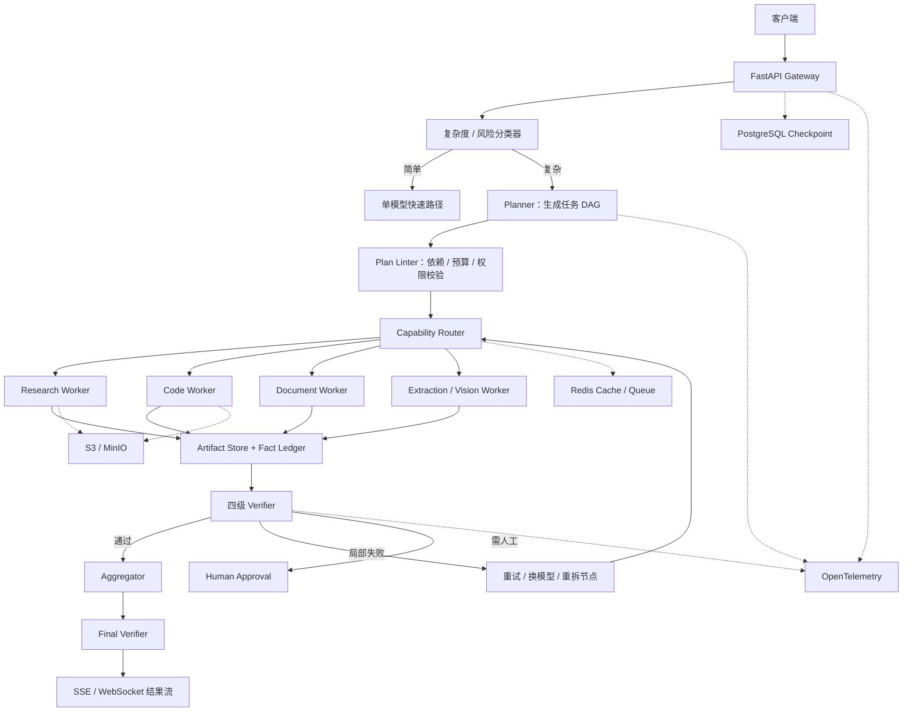

# 复杂任务的异构 LLM 实时编排系统：可实施方案

> 版本：1.0
>
> 日期：2026-08-19
>
> 所属项目：AIData
>
> 目标：把复杂任务拆成可验证的任务 DAG，为每个节点选择最合适的 LLM 或工具，支持并行执行、流式返回、局部重试、动态重规划和证据化汇聚。

## 一、方案摘要

本方案实现一个 **Planner–Router–Workers–Verifier–Aggregator** 系统：

1. 请求进入后先做复杂度与风险分类，简单任务直接走单模型快速路径；
2. 复杂任务由规划器生成结构化任务 DAG，而不是自然语言待办列表；
3. 路由器根据任务类型、能力要求、历史成功率、成本、p95 时延、数据权限和模型健康状态选择执行模型；
4. 没有依赖关系的子任务并行执行，结果写入共享产物库；
5. 每个结果先经过 schema、确定性规则、证据和语义四级验证；
6. 失败节点只做局部重试、换模型或重新拆分，不重跑整个流程；
7. 汇聚器基于经过验证的事实台账和冲突表生成最终结果；
8. 全流程通过 SSE 流式返回状态和局部结果，并使用 OpenTelemetry 记录质量、成本和时延。

第一版采用**规则与历史统计驱动的路由**，避免一开始引入难以评测的强化学习调度器。积累数据后，再升级为监督学习或 contextual bandit 路由。

## 二、目标、边界与验收口径

### 1. 目标

- 提高跨领域复杂任务的端到端完成率；
- 将简单子任务交给便宜、快速模型，控制平均成本；
- 并行执行独立任务，缩短关键路径；
- 让每个中间结论可验证、可追踪、可重放；
- 支持模型供应商替换，而不修改业务工作流；
- 支持实时状态、部分结果和最终结果流式返回；
- 对高风险工具调用和不可逆操作提供审批点。

### 2. 暂不纳入第一版

- 无边界的代理自由群聊；
- 代理自行创建无限数量的新代理；
- 跨组织开放代理市场；
- 端到端强化学习训练编排器；
- 在没有离线评测的情况下自动引入新模型；
- 允许模型直接持有生产数据库写权限或长期密钥。

### 3. 实时性的定义

复杂任务不可能都在几秒内得到完整答案，因此将“实时”拆成三个层次：

| 层次 | 建议目标 | 用户体验 |
|---|---:|---|
| 请求确认 | p95 小于 200 ms | 立即返回 `task_id` 和事件流地址 |
| 计划可见 | p95 小于 3 s | 展示任务图、预算和预计步骤 |
| 首个有效中间结果 | p95 小于 8 s | 流式展示已验证的局部产物 |
| 标准复杂任务最终结果 | p95 小于 45 s | 适用于 2–6 个常规子任务 |
| 深度研究型任务 | 1–5 min，可异步 | 持续流式更新，完成后通知 |

这些是系统目标而非模型供应商保证。最终 SLA 应根据真实模型、网络、工具和业务任务重新测量。

## 三、总体架构



### 服务职责

| 服务 | 职责 | 是否调用 LLM |
|---|---|---|
| API Gateway | 鉴权、限流、任务创建、SSE、取消 | 否 |
| Complexity Classifier | 判断快速路径/复杂路径、风险级别 | 优先使用规则或小模型 |
| Planner | 生成结构化任务 DAG | 是，使用强推理模型 |
| Plan Linter | 检查环、依赖、预算、权限和覆盖度 | 否，必要时让 Planner 修复 |
| Capability Router | 过滤候选模型并计算效用分数 | 第一版不调用 LLM |
| Worker Pool | 检索、代码、长文档、抽取、视觉等执行 | 是，也可调用工具 |
| Verifier | schema、测试、证据、语义验证 | 部分使用 LLM |
| Aggregator | 冲突消解、整体推导和最终写作 | 是，使用强模型 |
| State/Artifact Service | 检查点、产物、事实台账、版本 | 否 |
| Observability | trace、metric、log、成本归因 | 否 |

## 四、推荐技术栈

### 1. MVP 技术选型

| 层 | 推荐组件 | 选择理由 |
|---|---|---|
| API | Python 3.12 + FastAPI + Pydantic 2 | 异步、类型契约清晰、生态成熟 |
| 编排 | LangGraph | 有状态图、条件边、检查点、人工介入 |
| 模型与 Provider 执行 | OpenRouter；需要完全自管时使用 LiteLLM Proxy | OpenRouter 提供统一模型市场、Provider 路由和故障转移；LiteLLM 适合自管密钥、内网模型和定制网关策略 |
| 元数据与检查点 | PostgreSQL | 强一致状态、审计、任务查询 |
| 缓存与短队列 | Redis | 路由缓存、事件流、分布式锁、限流 |
| 大产物 | S3 或 MinIO | 文档、代码包、图片和执行结果不进入 prompt 历史 |
| 工具协议 | MCP | 统一检索、数据库、文件和 SaaS 工具接口 |
| 跨代理协议 | A2A，按需启用 | 仅跨团队或跨信任域代理使用 |
| 可观测性 | OpenTelemetry + Prometheus + Grafana + Tempo | 跨模型、工具和节点统一追踪 |
| 部署 | Docker；生产使用 Kubernetes | worker 隔离、弹性扩缩和资源配额 |
| 策略 | OPA 或应用内策略引擎 | 工具、模型、数据域和审批策略 |

第一版不建议同时引入 Temporal。若后续出现大量跨小时任务、复杂补偿事务或跨集群恢复需求，再将 Temporal 作为外层 durable workflow，LangGraph 保留为单任务内部语义编排。

### 2. 模型不写死，使用逻辑别名

业务代码只引用逻辑别名：

```yaml
model_aliases:
  planner_primary:
    candidates: [provider_a/reasoning-model, provider_b/reasoning-model]
    required: [reasoning, structured_output]
  worker_fast:
    candidates: [provider_c/fast-model, local/small-instruct]
    required: [low_latency, structured_output]
  worker_code:
    candidates: [provider_a/code-model, local/code-model]
    required: [code, tool_calling]
  worker_long_context:
    candidates: [provider_b/long-context-model]
    required: [long_context]
  aggregator_primary:
    candidates: [provider_a/reasoning-model, provider_b/reasoning-model]
    required: [synthesis, citation_preservation]
```

真实模型 ID 由离线评测和线上健康状态决定，不应散落在 prompt 或工作流代码中。

## 五、核心数据结构

### 1. 任务请求

```json
{
  "task_id": "tsk_01J...",
  "tenant_id": "tenant_a",
  "objective": "分析某技术路线并给出实施建议",
  "inputs": [
    {"type": "file", "uri": "s3://bucket/input.pdf"}
  ],
  "constraints": {
    "language": "zh-CN",
    "deadline_ms": 60000,
    "max_cost_usd": 2.0,
    "data_classification": "internal",
    "required_output": "markdown"
  }
}
```

### 2. 规划器输出

```json
{
  "plan_id": "plan_01J...",
  "objective": "分析某技术路线并给出实施建议",
  "global_acceptance_criteria": [
    "结论覆盖技术、成本、风险和路线图",
    "外部事实附带来源",
    "所有数字注明时间和口径"
  ],
  "tasks": [
    {
      "id": "T1",
      "type": "research",
      "description": "收集论文、开源项目和产业证据",
      "depends_on": [],
      "required_capabilities": ["web_search", "citation"],
      "allowed_tools": ["web_search", "document_fetch"],
      "input_refs": ["request.objective"],
      "output_schema": "ResearchEvidenceV1",
      "acceptance_criteria": ["至少三个独立来源", "每条事实可回溯"],
      "budget": {"max_cost_usd": 0.5, "timeout_ms": 20000},
      "risk_level": "low"
    },
    {
      "id": "T2",
      "type": "architecture",
      "description": "形成候选系统架构",
      "depends_on": [],
      "required_capabilities": ["system_design", "reasoning"],
      "allowed_tools": [],
      "output_schema": "ArchitectureOptionsV1",
      "acceptance_criteria": ["至少两个备选", "明确取舍"],
      "budget": {"max_cost_usd": 0.4, "timeout_ms": 15000},
      "risk_level": "low"
    },
    {
      "id": "T3",
      "type": "synthesis",
      "description": "综合证据与架构，形成建议",
      "depends_on": ["T1", "T2"],
      "required_capabilities": ["synthesis"],
      "allowed_tools": [],
      "output_schema": "FinalReportV1",
      "acceptance_criteria": ["引用仅来自已验证事实台账"],
      "budget": {"max_cost_usd": 0.6, "timeout_ms": 15000},
      "risk_level": "medium"
    }
  ]
}
```

### 3. Worker 输出信封

```json
{
  "task_id": "T1",
  "attempt": 1,
  "model_alias": "worker_research",
  "model_version": "resolved-at-runtime",
  "status": "completed",
  "result": {},
  "evidence": [
    {
      "claim_id": "C1",
      "claim": "某项可验证事实",
      "source_uri": "https://example.com/source",
      "retrieved_at": "2026-08-19T10:00:00Z",
      "source_excerpt_hash": "sha256:..."
    }
  ],
  "assumptions": [],
  "uncertainties": [],
  "usage": {
    "input_tokens": 1200,
    "output_tokens": 600,
    "cost_usd": 0.03,
    "latency_ms": 4200
  }
}
```

### 4. 状态机

```text
RECEIVED
  → CLASSIFIED
  → FAST_PATH | PLANNING
  → PLAN_VALIDATION
  → RUNNING
  → VERIFYING
  → RETRYING | REPLANNING | WAITING_APPROVAL
  → SYNTHESIZING
  → FINAL_VALIDATION
  → COMPLETED | PARTIAL | FAILED | CANCELLED
```

每次状态迁移写入不可变事件表；当前状态是事件折叠结果，从而支持重放、审计和故障恢复。

## 六、任务拆解与 Plan Linter

### 1. Planner 的职责

Planner 只负责形成任务图，不直接完成子任务。系统提示必须要求它：

- 将每项用户约束映射到任务或全局验收标准；
- 仅在能力、工具、数据或验证方式不同的情况下拆分节点；
- 把无依赖节点标为可并行；
- 明确每个节点的输入引用和输出 schema；
- 为每个节点设置超时、预算和风险等级；
- 避免把“写引言”“写结论”拆成没有独立价值的伪子任务；
- 给出失败时可采用的替代策略。

### 2. Plan Linter 的确定性规则

第一版建议强制：

- DAG 不允许存在环；
- 默认节点数不超过 12，图深度不超过 5；
- 所有依赖必须引用已定义节点；
- 每个叶子节点必须有 output schema 和验收标准；
- 子任务预算总和不得超过全局预算；
- 高风险节点必须存在审批点；
- 工具必须在租户和任务白名单内；
- 所有全局验收标准必须映射到至少一个节点；
- 同一输入、任务类型和输出 schema 的重复节点应合并；
- Planner 最多修复计划两次，仍不合法则转人工或降级到模板流程。

### 3. 常用任务模板

先内置少量模板可以显著降低错误拆解：

| 场景 | 默认任务图 |
|---|---|
| 深度研究 | 范围界定 → 并行检索 → 证据去重 → 争议核验 → 综合 |
| 软件开发 | 需求澄清 → 设计 → 实现 → 测试 → 修复 → 审查 |
| 数据分析 | 数据检查 → 清洗 → 统计/建模 → 结果验证 → 解释 |
| 长文档处理 | 分块抽取 → 主题归并 → 跨块一致性检查 → 汇总 |
| 方案评审 | 约束抽取 → 多方案生成 → 独立风险审查 → 决策矩阵 |

Planner 优先填充模板，只有不匹配时才生成自由 DAG。

## 七、模型能力注册与路由算法

### 1. 模型能力表

```yaml
models:
  - id: provider_a/model_x
    capabilities:
      reasoning: 0.92
      coding: 0.88
      long_context: 0.74
      citation: 0.70
      structured_output: 0.97
    limits:
      context_tokens: 200000
      supports_tools: true
      supports_vision: true
    policy:
      allowed_data_classes: [public, internal]
      allowed_regions: [apac]
    performance:
      p50_latency_ms: 2200
      p95_latency_ms: 6500
      recent_error_rate: 0.008
    pricing:
      input_per_million: 0.0
      output_per_million: 0.0
```

价格字段由定时任务从批准的配置源更新；不要在代码中写死。能力分数来自内部评测，不直接使用厂商宣传分数。

### 2. 两阶段路由

#### 第一阶段：硬过滤

剔除以下模型：

- 不具备必需能力、模态或工具调用功能；
- 上下文窗口不足；
- 不满足数据分类、区域或供应商策略；
- 当前熔断、限流或健康状态异常；
- 预计费用或 p95 延迟超过节点预算；
- 没有通过该任务类型的最低离线评测门槛。

#### 第二阶段：效用评分

对剩余模型计算：

\[
Score(m,t)=
w_q\hat{Q}(m,t)
-w_c\hat{C}(m,t)
-w_l\hat{L}(m,t)
-w_r\hat{R}(m,t)
+w_hH(m)
\]

其中：

- \(\hat{Q}\)：任务成功率或质量预测；
- \(\hat{C}\)：归一化预期费用；
- \(\hat{L}\)：归一化 p95 时延；
- \(\hat{R}\)：策略、安全和近期错误风险；
- \(H\)：健康度、缓存命中或可用容量奖励。

默认按任务等级使用不同权重：

| 等级 | 质量 | 成本 | 时延 | 风险 |
|---|---:|---:|---:|---:|
| 交互快速 | 0.35 | 0.20 | 0.35 | 0.10 |
| 标准复杂 | 0.50 | 0.20 | 0.20 | 0.10 |
| 高价值分析 | 0.65 | 0.10 | 0.10 | 0.15 |
| 高风险决策 | 0.45 | 0.05 | 0.05 | 0.45 |

### 3. 第一版质量预测

第一版采用任务类型 × 模型版本的指数移动平均：

```text
quality_estimate =
  0.50 × verifier_pass_rate
+ 0.30 × human_accept_rate
+ 0.20 × no_retry_completion_rate
```

样本不足时使用保守先验，并把新模型限制在 5% shadow traffic。积累足够数据后，可升级为 Logistic Regression、XGBoost 或 contextual bandit；在没有稳定奖励信号前不建议直接使用强化学习。

### 4. Fallback 链

每个节点在执行前生成 fallback：

```text
首选模型
→ 同等级同能力替代模型
→ 更强但更贵的升级模型
→ 任务重新拆分
→ 人工处理
```

超时和供应商错误可以自动换模型；语义验证失败必须携带失败原因重新执行，不能盲目重复相同 prompt。

### 5. OpenRouter 执行映射

推荐把语义路由和执行路由分开：

```text
本地 Capability Router：决定用哪个模型或哪种协作模式
    -> OpenRouter Model API：调用固定模型或受限 Auto Router
        -> OpenRouter Provider Routing：选择健康、合规且满足价格/时延偏好的 endpoint
            -> 本系统 Verifier：判断答案质量是否通过
```

本地 Router 有足够业务数据时，应发送固定模型 slug，让 OpenRouter 只负责 Provider 选择：

```json
{
  "model": "resolved/model-slug",
  "messages": [],
  "max_tokens": 2000,
  "provider": {
    "zdr": true,
    "data_collection": "deny",
    "require_parameters": true,
    "allow_fallbacks": true,
    "preferred_max_latency": {
      "p90": 4,
      "p99": 10
    },
    "max_price": {
      "prompt": 5,
      "completion": 20
    }
  }
}
```

业务数据不足的长尾子任务可以受限使用 Auto Router：

```json
{
  "model": "openrouter/auto",
  "session_id": "opaque-workflow-branch-id",
  "messages": [],
  "plugins": [
    {
      "id": "auto-router",
      "cost_tier": "medium",
      "allowed_models": [
        "anthropic/*",
        "openai/*",
        "google/*"
      ]
    }
  ],
  "provider": {
    "zdr": true,
    "data_collection": "deny",
    "require_parameters": true,
    "allow_fallbacks": true
  }
}
```

实施规则：

- Auto Router 当前以任务分类和最近七日市场 Spend Share 为主要信号，只作为长尾先验，不替代内部质量模型。
- 不相关的并行分支使用不同 `session_id`，避免会话粘性让一个分支的模型选择影响另一个分支；同一依赖链可复用一个不含个人信息的 opaque session。
- `cost_tier` 是价格带而不是单请求成本上限；总预算仍由本系统结合输入 token、`max_tokens`、工具成本、重试次数和剩余预算控制。
- 每次请求设置 `X-OpenRouter-Metadata: enabled`，记录实际模型、Provider、尝试次数、路由策略和 pipeline 阶段。
- OpenRouter Model Fallback 用于限流、宕机、上下文或审核等调用错误；答案质量不足由本系统 Verifier 触发更强模型升级；任务结构错误才进入局部重规划。
- 如果企业要求所有密钥、日志和内网模型完全自管，可保留相同的 Model Gateway 接口，将执行实现替换为 LiteLLM Proxy，不改变 DAG、Router、Verifier 和 Artifact 协议。

对应边界为：

```text
Provider/API 失败  -> OpenRouter Provider / Model Fallback
答案质量失败      -> Verifier -> 更强模型、平行复核或修复
任务结构失败      -> Plan Linter / Replanner -> 修改局部 DAG
```

## 八、并行执行与实时调度

### 1. 调度原则

- 只调度所有依赖均已通过验证的 `READY` 节点；
- 默认单任务最大并发数为 4，租户和全局另设并发上限；
- 优先调度关键路径、短任务和可释放大量下游依赖的节点；
- 相同检索或文档解析请求使用内容哈希去重；
- 达到费用、token 或墙钟预算时停止非关键节点；
- 用户取消后立即停止尚未开始的节点，并向运行中的工具发送取消信号；
- 节点结果只有在验证通过后才解锁下游。

### 2. 调度优先级

```text
priority =
  0.40 × critical_path_score
+ 0.25 × downstream_unlock_count
+ 0.20 × user_priority
+ 0.15 × expected_duration_inverse
```

第一版可以使用内存中的优先队列；多副本部署时使用 Redis Streams 或专用任务队列，并通过数据库租约避免重复执行。

### 3. 流式事件

SSE 至少包含：

```text
task.accepted
plan.created
plan.validated
node.started
node.partial
node.completed
node.verification_failed
node.retrying
plan.revised
approval.required
synthesis.started
task.completed
task.failed
```

`node.partial` 只能暴露明确标注为“未最终验证”的内容；进入最终报告的事实必须来自已验证事实台账。

## 九、Worker 设计

### 1. 推荐的初始 Worker 集合

| Worker | 模型特征 | 工具 | 输出 |
|---|---|---|---|
| Research | 搜索、引用和事实抽取稳定 | 搜索、网页读取 | Evidence Bundle |
| Document | 长上下文和跨章节理解 | 文件读取、OCR | Document Findings |
| Code | 代码生成、调试和结构化推理 | 隔离代码沙箱 | Code Artifact + Tests |
| Data | 表格、SQL、统计和可视化 | 数据库只读、Python | Analysis Result |
| Extract | 快速、低成本、JSON 稳定 | 无或轻量工具 | Typed Records |
| Vision | 图表、截图和扫描件理解 | OCR、图像工具 | Visual Findings |
| Critic | 反例、遗漏和约束检查 | 只读产物 | Review Findings |

第一版控制在 4–6 类 Worker。只有当评测证明新增 Worker 带来独立增益时才扩充。

### 2. Worker 上下文包

Worker 不接收完整群聊历史，只接收：

```json
{
  "global_objective": "...",
  "task_contract": {},
  "relevant_constraints": [],
  "input_artifact_refs": [],
  "upstream_result_refs": [],
  "allowed_tools": [],
  "acceptance_criteria": [],
  "remaining_budget": {}
}
```

这能够降低锚定、提示注入扩散和重复 token 成本。

### 3. 代码与工具隔离

- 代码在一次性容器或沙箱运行；
- 默认无外网，仅按任务开放域名；
- 文件系统只挂载当前任务目录；
- CPU、内存、运行时间和进程数有限额；
- 密钥通过短期凭证注入，不写入 prompt、日志或产物；
- 数据库默认只读，写操作必须经过审批工具；
- 所有 MCP 工具调用记录参数摘要、调用者、结果哈希和策略判定。

## 十、四级验证与局部恢复

### 1. 验证顺序

| 层级 | 方法 | 失败处理 |
|---|---|---|
| V1 Schema | Pydantic/JSON Schema、必填字段、类型 | 原模型按错误信息修复一次 |
| V2 Deterministic | 单元测试、编译、SQL 约束、数值重算 | 同模型修复或切换代码/数据模型 |
| V3 Evidence | URL、时间、来源独立性、引用与结论一致性 | Research Worker 补证据 |
| V4 Semantic | 完整性、矛盾、用户约束和风险检查 | Critic 或独立 Judge 复核 |

能用确定性方法验证时，不应只使用 LLM Judge。

### 2. 失败决策树

```text
供应商/网络错误
  → 同模型重试一次 → fallback 模型

Schema 错误
  → 带验证错误修复一次 → structured-output 更稳定模型

确定性测试失败
  → 原 Worker 修复 → Code/Data 专家升级

证据不足
  → 补检索 → 换来源 → 标记无法确认

任务契约不合理
  → 重新拆分当前节点 → 必要时修改下游依赖

高风险或重复失败
  → Human-in-the-loop
```

节点默认最多执行三次：原模型、fallback、升级/重拆。超过上限进入 `PARTIAL` 或人工处理，禁止无限循环。

### 3. 检查点失效规则

- 上游结果内容哈希未改变：复用下游缓存；
- 上游结果改变但 schema 兼容：仅失效读取该字段的节点；
- schema 或关键假设改变：失效所有传递闭包中的下游节点；
- Planner 修改无关分支：已验证产物保持有效。

## 十一、事实台账、冲突消解与汇聚

### 1. 事实台账

汇聚器不直接阅读所有原始对话，而是读取：

```json
{
  "claims": [
    {
      "claim_id": "C1",
      "statement": "...",
      "status": "verified",
      "evidence_refs": ["E1", "E2"],
      "scope": {"year": 2026, "region": "global"},
      "confidence": 0.88
    }
  ],
  "assumptions": [],
  "unresolved_questions": [],
  "conflicts": []
}
```

### 2. 冲突对象

```json
{
  "conflict_id": "CF1",
  "topic": "市场规模",
  "claim_a": "C1",
  "claim_b": "C7",
  "difference_dimensions": ["definition", "year"],
  "resolution": "保留两种口径并分别说明",
  "resolution_status": "resolved"
}
```

汇聚器必须优先判断时间、地域、定义和统计口径差异，不得只根据语言自信程度选择结论。

### 3. Aggregator 约束

- 只能引用 `verified` 事实；
- 对未解决冲突明确标注，不强行统一；
- 不得生成事实台账之外的新数字和来源；
- 必须覆盖全局验收标准；
- 输出中保留关键假设与不确定性；
- 生成后再次执行引用、数字、章节覆盖和格式检查。

## 十二、外部 API

### 1. 创建任务

```http
POST /v1/tasks
Content-Type: application/json
Idempotency-Key: 6a9f...
```

```json
{
  "objective": "比较三种技术方案并给出推荐",
  "inputs": [],
  "constraints": {
    "deadline_ms": 60000,
    "max_cost_usd": 1.5,
    "stream": true
  }
}
```

```json
{
  "task_id": "tsk_01J...",
  "status": "RECEIVED",
  "events_url": "/v1/tasks/tsk_01J.../events",
  "status_url": "/v1/tasks/tsk_01J..."
}
```

### 2. 事件流

```http
GET /v1/tasks/{task_id}/events
Accept: text/event-stream
```

### 3. 查询、取消和反馈

```text
GET  /v1/tasks/{task_id}
GET  /v1/tasks/{task_id}/plan
GET  /v1/tasks/{task_id}/artifacts
POST /v1/tasks/{task_id}/cancel
POST /v1/tasks/{task_id}/approvals/{approval_id}
POST /v1/tasks/{task_id}/feedback
```

所有写接口必须支持幂等键；事件带单调递增序号，客户端断线后可用 `Last-Event-ID` 续传。

## 十三、核心执行伪代码

```python
async def run_complex_task(request: TaskRequest) -> FinalResult:
    task = await state.create(request)

    route = complexity_classifier.classify(request)
    if route == "fast":
        return await fast_path.run(request)

    plan = await planner.create_plan(request)
    plan = await plan_linter.validate_or_repair(plan, max_repairs=2)
    await state.save_plan(task.id, plan)

    while not plan.is_terminal():
        ready_nodes = plan.ready_nodes()
        selected = scheduler.select(
            ready_nodes,
            max_concurrency=task.remaining_concurrency,
            remaining_budget=task.remaining_budget,
        )

        executions = [
            execute_node(node, router.choose(node, task.context))
            for node in selected
        ]

        for result in await asyncio.gather(*executions):
            verdict = await verifier.verify(result)

            if verdict.passed:
                await artifacts.commit(result)
                plan.mark_completed(result.task_id)
            else:
                action = recovery_policy.decide(result, verdict, task)
                plan = await apply_recovery(action, plan, result, verdict)

        await event_stream.publish_progress(task.id, plan.snapshot())

    draft = await aggregator.synthesize(
        objective=request.objective,
        fact_ledger=await artifacts.fact_ledger(task.id),
        acceptance_criteria=plan.global_acceptance_criteria,
    )

    final_verdict = await final_verifier.verify(draft)
    return await finalize_or_repair(draft, final_verdict)
```

## 十四、代码目录建议

```text
heterogeneous-llm-orchestrator/
├── apps/
│   ├── api/                    # FastAPI、SSE、鉴权
│   └── worker/                 # 分布式 Worker 入口
├── orchestrator/
│   ├── graph.py                # LangGraph 主图
│   ├── planner.py
│   ├── plan_linter.py
│   ├── scheduler.py
│   ├── recovery.py
│   └── state_machine.py
├── routing/
│   ├── registry.py
│   ├── eligibility.py
│   ├── scorer.py
│   ├── fallback.py
│   └── health.py
├── workers/
│   ├── research.py
│   ├── document.py
│   ├── code.py
│   ├── data.py
│   ├── extraction.py
│   └── vision.py
├── verification/
│   ├── schema.py
│   ├── deterministic.py
│   ├── evidence.py
│   └── semantic.py
├── synthesis/
│   ├── fact_ledger.py
│   ├── conflict_resolver.py
│   └── aggregator.py
├── adapters/
│   ├── llm_gateway.py
│   ├── mcp.py
│   ├── storage.py
│   └── telemetry.py
├── schemas/
│   ├── task.py
│   ├── plan.py
│   ├── result.py
│   └── events.py
├── evals/
│   ├── datasets/
│   ├── graders/
│   ├── baselines/
│   └── reports/
├── config/
│   ├── models.yaml
│   ├── routing.yaml
│   ├── policies.yaml
│   └── budgets.yaml
├── tests/
│   ├── unit/
│   ├── contract/
│   ├── integration/
│   ├── chaos/
│   └── security/
└── deploy/
    ├── docker-compose.yaml
    └── k8s/
```

## 十五、部署拓扑

### 1. 开发/试验环境

使用 Docker Compose：

- 1 个 API/Orchestrator；
- 1–2 个 Worker；
- PostgreSQL；
- Redis；
- MinIO；
- LiteLLM Proxy；
- OpenTelemetry Collector；
- Grafana/Tempo 可选。

### 2. 生产环境

Kubernetes 中拆分：

- API Deployment：无状态，按请求数扩缩；
- Orchestrator Deployment：按活动任务数扩缩；
- 不同 Worker Deployment：按任务类型和资源需求分别扩缩；
- Code Worker：独立节点池和严格 sandbox；
- LiteLLM Gateway：多副本，供应商级熔断；
- PostgreSQL：托管高可用实例；
- Redis：高可用，不能作为唯一持久状态；
- S3：版本化和生命周期策略；
- OTel Collector：集中导出 trace、metric、log。

### 3. 容量估算方法

不要直接按用户数估算，应按节点执行量计算：

```text
每秒 Worker 调用量
= 每秒复杂任务数
× 平均节点数
× 平均重试系数
÷ 平均并行度
```

模型供应商的 RPM、TPM、并发连接和区域配额都应进入调度器容量模型。

## 十六、安全与治理

### 1. 信任分区

| 区域 | 内容 | 默认信任级别 |
|---|---|---|
| 用户输入 | prompt、上传文件 | 不可信 |
| 外部网页/MCP | 网页、远程工具结果 | 不可信 |
| 内部只读数据 | 企业文档、分析库 | 受控 |
| Worker 产物 | 模型输出、代码、推理结果 | 未验证 |
| Fact Ledger | 通过验证的事实 | 可信但可撤销 |
| 最终输出 | 对外结果 | 必须经过最终策略检查 |

### 2. 强制措施

- 每个 Worker 使用独立服务身份和工具白名单；
- prompt、工具参数和产物分开存储与转义；
- 外部文本不得直接拼接为 system/developer 指令；
- 远程 A2A Agent Card 和返回产物按不可信数据处理；
- PII、密钥和受限数据在进入模型前执行策略过滤；
- 不同数据分类只能路由到批准的模型和区域；
- 高风险工具必须由 OPA/策略层批准，模型无权绕过；
- 所有人工审批记录审批者、时间、变更和理由；
- 日志默认不记录原始敏感 prompt，只记录哈希、分类和必要摘要。

## 十七、可观测性与运营指标

### 1. Trace 层级

```text
Task Trace
├── classification span
├── planning span
├── plan validation span
├── node execution span × N
│   ├── model call span
│   ├── tool call span
│   └── verification span
├── recovery/replan span
└── aggregation/final verification span
```

### 2. 必须记录的指标

- `task_success_rate{task_type}`；
- `task_partial_rate`、`task_failure_rate`；
- `node_verifier_pass_rate{node_type,model}`；
- `model_cost_usd{model,tenant}`；
- `task_total_cost_usd`；
- `task_latency_ms` 的 p50/p95/p99；
- `time_to_plan_ms`、`time_to_first_verified_result_ms`；
- `router_selection_count` 和 fallback 率；
- `retry_count`、`replan_count`、循环终止率；
- 工具超时、拒绝、越权和提示注入检测次数；
- 缓存命中率、重复检索消除量；
- 每个模型版本的质量—成本 Pareto 位置。

### 3. 告警

- 某模型 5 分钟错误率超过阈值时自动熔断；
- p95 时延或单任务成本超过预算；
- fallback 率突然增加；
- schema 合法率下降；
- 同一任务出现三次以上重规划；
- 高风险工具出现未审批调用；
- 新模型 shadow 质量显著低于当前模型。

## 十八、评测与上线门槛

### 1. 离线数据集

先构建 300–1,000 条领域任务，按以下维度分层：

- 简单/中等/复杂；
- 单领域/跨领域；
- 有无工具；
- 串行/可并行；
- 可确定性验证/需人工判断；
- 正常输入/提示注入/缺失数据/工具故障。

### 2. 必须比较的基线

1. 最强单模型一次调用；
2. 最强单模型 + 工具；
3. 最强单模型多采样/Self-MoA；
4. 固定模型、固定 DAG；
5. 本方案的动态模型路由；
6. 去掉 Verifier、局部重试或并行调度的消融版本。

所有比较至少固定一种预算：相同费用、相同 token 或相同墙钟时间。

### 3. 建议的首期上线门槛

以下数值是初始建议，应由业务风险重新设定：

| 指标 | 建议门槛 |
|---|---:|
| 复杂任务成功率 | 比强单模型基线至少提升 8 个百分点 |
| 全局验收标准覆盖率 | 大于等于 98% |
| 结构化输出合法率 | 大于等于 99.5% |
| 未授权高风险工具调用 | 0 |
| 标准复杂任务 p95 | 小于等于 45 s |
| 首个已验证结果 p95 | 小于等于 8 s |
| 中位任务成本 | 不超过强单模型方案的 2 倍，或达到业务预算 |
| 无限循环/错误终止 | 0；达到上限必须进入受控状态 |
| 可重放率 | 大于等于 99% |

质量没有显著提升时，即使架构运行正常也不应上线多模型路径。

### 4. 上线方式

```text
离线回放
→ 5% shadow traffic
→ 1% 内部用户 canary
→ 10% 真实流量
→ 按任务类型逐步放量
→ 保留单模型一键降级开关
```

新模型、Planner prompt、路由权重和验证规则都必须作为独立版本发布，支持快速回滚。

## 十九、六周实施计划

### 第 1 周：基础设施与单模型基线

- 建立 FastAPI、LiteLLM、PostgreSQL、Redis、S3/MinIO；
- 定义 Task、Plan、NodeResult 和 Event schema；
- 接入两个模型供应商和一个本地/低成本模型；
- 建立最强单模型与单模型工具基线；
- 完成 OTel trace 和成本核算。

交付物：可创建任务、调用模型、流式返回并记录完整 trace。

### 第 2 周：Planner、DAG 与状态机

- 实现 Planner structured output；
- 实现 Plan Linter 和最多两次修复；
- 实现 DAG 状态机、检查点、取消和恢复；
- 内置 3–5 个常见任务模板。

交付物：复杂请求可稳定生成合法任务图并展示计划。

### 第 3 周：Worker 与能力路由

- 实现 Research、Document、Code、Extract 四类 Worker；
- 建立模型能力注册表、硬过滤和效用评分；
- 实现 fallback、熔断和健康检查；
- 实现最大并发 4 的 ready-node 调度。

交付物：不同节点可按能力和预算分配模型并并行执行。

### 第 4 周：验证、局部重试与汇聚

- 实现四级 Verifier；
- 实现节点级重试、换模型和局部重拆；
- 建立 Fact Ledger 与 Conflict 对象；
- 实现 Aggregator 和 Final Verifier。

交付物：中间结果可验证，失败不必全流程重跑，最终答案可追溯。

### 第 5 周：安全、实时体验和故障演练

- 完善 SSE 断线续传和部分结果；
- 工具白名单、短期凭证、沙箱和审批；
- 增加超时、限流、供应商故障和恶意输入测试；
- 建立 Grafana dashboard 与告警。

交付物：具备生产所需的实时反馈、基本安全边界和故障恢复能力。

### 第 6 周：评测、Shadow 与 Canary

- 建立至少 300 条任务的评测集；
- 完成六组基线与消融；
- 调整路由权重、预算和超时；
- 开展 5% shadow 和内部 canary；
- 形成 go/no-go 报告和回滚预案。

交付物：有数据证明质量—成本—时延收益，而不是只证明系统能够运行。

## 二十、人员投入建议

MVP 建议 3–4 人：

| 角色 | 主要工作 |
|---|---|
| 后端/平台工程师 | API、状态、队列、部署、可观测性 |
| LLM/Agent 工程师 | Planner、Worker、路由、prompt 和模型适配 |
| 评测/数据工程师 | 数据集、Verifier、质量预测和分析 |
| 安全/领域专家，可兼职 | 权限、红队、验收标准和人工评审 |

如果只有 1–2 人，应先做单进程 LangGraph + PostgreSQL + LiteLLM 版本，暂不拆分微服务；服务边界保留在代码模块中，流量和团队规模增长后再拆。

## 二十一、关键决策与停止条件

### 建议立即执行的决策

1. 使用任务 DAG，不使用自由群聊作为主控制面；
2. 使用逻辑模型别名，不把具体模型写死在业务代码；
3. 第一版路由使用确定性过滤 + 历史统计评分；
4. 只传递结构化上下文和产物引用；
5. 确定性验证优先于 LLM Judge；
6. 节点级重试和检查点从第一版实现；
7. A2A 仅在确有跨团队代理需求时启用；
8. 每个复杂请求都保留单模型降级路径。

### 应停止扩展多模型的情形

- 等预算下无法超过强单模型或 Self-MoA 基线；
- 新 Worker 只产生重复信息；
- 汇聚错误率抵消了专业化收益；
- p95 延迟或费用长期超过业务上限；
- 缺乏可靠验收标准，无法判断协作是否改善；
- 安全和审计无法覆盖跨代理数据流。

## 二十二、最终推荐

最小可行形态应是：

```text
FastAPI + LangGraph + LiteLLM
+ PostgreSQL Checkpoint + Redis
+ 4 类 Worker
+ 规则/统计 Capability Router
+ 四级 Verifier
+ Fact Ledger / Conflict Resolver
+ SSE + OpenTelemetry
```

先在一个具体场景中实现，例如深度研究、软件开发或技术方案评审，不要一开始建设通用代理平台。首个版本的成功标准不是“调用了多个模型”，而是：

> 在固定预算下，复杂任务完成率显著高于强单模型；执行过程可追踪；失败能够局部恢复；用户可以及时看到计划和已验证结果。

## 参考资料

- [多模型协作 SOTA 综述](./多模型协作_SOTA_综述_2026-08.md)
- [生成模型路由 SOTA 综述](./生成模型路由SOTA综述_2026.md)
- [RouteLLM](https://arxiv.org/abs/2406.18665)
- [RouterBench](https://arxiv.org/abs/2403.12031)
- [Mixture-of-Agents](https://arxiv.org/abs/2406.04692)
- [Self-MoA](https://arxiv.org/abs/2502.00674)
- [Why Do Multi-Agent LLM Systems Fail?](https://arxiv.org/abs/2503.13657)
- [Multi-Agent Collaboration via Evolving Orchestration](https://arxiv.org/abs/2505.19591)
- [LangGraph](https://github.com/langchain-ai/langgraph)
- [LiteLLM](https://github.com/BerriAI/litellm)
- [OpenRouter Auto Router](https://openrouter.ai/docs/guides/routing/routers/auto-router)
- [OpenRouter Provider Routing](https://openrouter.ai/docs/guides/routing/provider-selection)
- [OpenRouter Model Fallbacks](https://openrouter.ai/docs/guides/routing/model-fallbacks)
- [OpenRouter Router Metadata](https://openrouter.ai/docs/guides/features/router-metadata)
- [A2A Specification](https://github.com/a2aproject/A2A/blob/main/docs/specification.md)
- [Model Context Protocol](https://modelcontextprotocol.io/)
