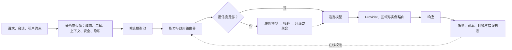

# 生成模型路由 SOTA 综述：从强弱模型级联到开放模型池、Agent 与 OpenRouter

> 更新日期：2026-08-19
>
> 范围：本文重点讨论在多个可独立调用的 LLM/VLM、推理配置和服务商之间动态选择的“模型级路由”。论文数字均来自各自实验设置，不能脱离模型池、数据集、价格快照和评价协议直接横向排名。

## 摘要

生成模型路由的目标，是根据请求内容、会话状态和系统约束，从一组能力、价格、速度和风险特征不同的模型中选择最合适的执行路径。它最初主要表现为“便宜模型是否应升级到强模型”的二元级联，随后发展为多模型能力匹配、在线上下文 bandit、新模型冷启动、多轮 Agent 长期决策，以及模型、采样数、推理预算、推理步骤和 provider 的联合优化。

截至 2026 年 8 月，这一领域不存在一个跨模型池、任务分布和成本约束都成立的唯一 SOTA。统一基准显示，模型间确实存在可利用的互补性，但不少复杂路由器不能稳定超过 Best-Single、简单 kNN/线性模型或成本阈值基线。实际系统中的关键，往往不是使用最复杂的路由网络，而是构造小而互补的候选池、建立可信评测、先执行安全与隐私硬约束，并持续校准模型、价格和流量分布的变化。

OpenRouter 代表了成熟的托管多模型市场、统一 API 和 provider 容错平面。其 Auto Router 当前采用“任务分类 + 最近七天市场消费份额”的动态选择机制，适合作为零样本、零运维基线；但这种市场信号不是应用特定的逐请求正确率估计，因此高风险或垂直场景仍应使用 allowlist、领域评测和自定义路由策略。

## 一、结论先行

当前最重要的结论可以概括为五点：

1. **没有跨场景成立的唯一 SOTA。** 同一个路由器更换候选模型、成本权重、评价器或任务分布后，排序可能明显改变。[LLMRouterBench](https://aclanthology.org/2026.findings-acl.1881/) 的统一实验尤其说明：今天的主要瓶颈经常不是路由器不够复杂，而是候选模型缺乏互补性，以及路由器没有召回真正能完成任务的模型。

2. **研究前沿已经越过简单的“强模型/弱模型二选一”。** 当前主要方向包括多模型与新模型冷启动、在线和因果学习、多轮 Agent、模型与 test-time compute 联合路由，以及带成本、时延、安全、隐私和可靠性约束的多目标路由。

3. **生产级 SOTA 是分层系统，而不是单个分类器。** 一个可靠系统通常包含硬约束过滤、候选池剪枝、直接路由、低置信度级联、模型选择后的 provider 路由、会话粘性、故障转移和在线校准。

4. **模型互补性比模型数量更重要。** 加入大量高度相似或被其他模型 Pareto 支配的候选项，会增加探索、训练和错误选择成本，但不一定增加 oracle 上限。

5. **OpenRouter 的价值不只在语义路由。** 它同时提供模型市场、统一接口、provider 选择、健康检查、价格/时延排序、模型 fallback、ZDR 和会话粘性。即使用户自建语义路由器，OpenRouter 仍可作为执行平面。

## 二、问题定义与边界

### 2.1 优化目标

对输入请求 `x`、会话历史 `h`、租户与业务约束 `s`，路由器需要从模型集合 `M` 中选择模型 `m`；更一般地，还需选择推理预算 `b`、采样数 `k`、服务商或区域 `p`：

```text
a* = argmax_a E[Q(x, h, a)] - λC(a) - μL(a) - νR(a)
```

其中：

- `Q`：正确率、偏好分、任务完成率或业务收益；
- `C`：输入/输出 token、router、judge、重试、级联和聚合的总成本；
- `L`：首 token 时延、端到端时延及尾延迟；
- `R`：安全、隐私、合规、格式错误和不可恢复操作风险。

实际生产中，约束形式通常比简单的“质量/成本比”更合理：

```text
maximize E[Q]
subject to E[C] <= B, P95(L) <= S, R <= ε
```

单纯最大化 `Q/C` 可能偏爱质量很差但极便宜的模型，也不能表达硬 SLA 或安全底线。

### 2.2 四种经常被混用的 Router

| 名称 | 选择对象 | 典型项目或方法 |
|---|---|---|
| 模型级语义路由 | 不同 LLM/VLM | RouteLLM、OpenRouter Auto、vLLM Semantic Router |
| 级联路由 | 先调用便宜模型，必要时升级 | FrugalGPT、AutoMix、HybridLLM |
| Provider/副本路由 | 同一模型的供应商、区域或实例 | OpenRouter Provider Routing、vLLM Router |
| 模型内部路由 | MoE expert、层或 token | MoE、R2R、动态层执行 |

本文以前两类为主，同时讨论生产系统必须考虑的 provider 路由。MoE 的 expert routing 属于模型内部训练与推理机制，不应与 API 层的模型选择混为一谈。

### 2.3 直接路由、级联和聚合

- **直接路由**：只看输入和上下文，在调用候选模型前作出一次选择，成本低、时延稳定。
- **输出感知级联**：先调用便宜模型，再依据输出置信度、验证器或 judge 决定是否升级；质量潜力更高，但会增加尾延迟。
- **并行聚合**：同时调用多个模型，再投票或由 judge 综合；适合高价值请求，但成本最高。
- **序贯 Agent 路由**：在多轮任务中根据环境状态和历史结果多次选择模型，优化的是最终任务成功率而非单轮回答。

一个重要建模原则是：**应该预测强模型相对便宜模型的边际收益，而不只是问题难度。** 某个问题即使很难，但所有模型都不会，也不值得升级；某个表面简单的问题，如果只有专用模型会做，则应直接路由给它。

## 三、技术演进

### 3.1 2023—2024：级联和二元强弱路由

早期工作主要回答：什么时候可以不调用最贵模型？

- **FrugalGPT** 将多个 API 组织为级联，并用候选生成和答案评分器决定是否升级。论文在当时的模型和价格设置中报告：匹配最强单模型表现时最高可节省约 98% 成本，或在相同预算下提升约 4% 准确率。结果高度依赖旧模型、旧价格和任务标注分布。[论文](https://arxiv.org/abs/2305.05176)

- **FORC** 将输入到模型的选择表示为用户可调的约束优化，在 14 个数据集、4 个模型上报告匹配最大模型时减少约 63% 成本。[论文](https://arxiv.org/abs/2308.06077)

- **AutoMix** 让小模型先作答，再使用自验证和 POMDP 决定是否升级，报告在保持相近表现时节省超过 50% 的成本。[论文](https://arxiv.org/abs/2310.12963)

- **HybridLLM** 学习查询难度或强弱模型质量差，并允许用阈值调整成本—质量曲线；论文报告在不降低质量时减少最多约 40% 的大模型调用。[论文](https://proceedings.iclr.cc/paper_files/paper/2024/hash/b47d93c99fa22ac0b377578af0a1f63a-Abstract-Conference.html)

- **ZOOTER / Routing to the Expert** 使用奖励模型生成监督信号，再蒸馏到轻量路由器中，是多专家路由的重要早期工作。[论文](https://aclanthology.org/2024.naacl-long.109/)

这一阶段的主要局限是候选模型少、模型池固定、依赖离线全反馈数据，并且很少考虑多轮状态、供应商可靠性和真实尾延迟。

### 3.2 2024—2025：多模型、模型感知与统一评测

**RouteLLM** 是目前最具代表性的强弱模型学习路由框架之一。它用偏好数据训练矩阵分解、加权 Elo、BERT 和因果语言模型路由器，并研究未见模型对之间的迁移；论文报告在不损失质量时实现两倍以上的成本下降。[论文](https://proceedings.iclr.cc/paper_files/paper/2025/hash/5503a7c69d48a2f86fc00b3dc09de686-Abstract-Conference.html)、[代码](https://github.com/lm-sys/RouteLLM)

随后出现了更强的模型感知表示：

- **RouterDC** 联合学习 query 和模型 embedding，用双重对比损失刻画“什么模型擅长什么请求”。[论文](https://arxiv.org/abs/2409.19886)
- **GraphRouter** 将任务、请求和模型构成异构图，并支持利用模型描述或少量样本接入新模型。[论文](https://proceedings.iclr.cc/paper_files/paper/2025/hash/41b6674c28a9b93ec8d22a53ca25bc3b-Abstract-Conference.html)
- **IRT-Router** 引入项目反应理论，显式建模模型能力和题目难度，优势是可解释并能处理一定程度的冷启动。[论文](https://aclanthology.org/2025.acl-long.761/)
- **Lookahead Routing** 不完整调用所有候选模型，而是预测潜在输出的隐表示再选择；论文在七个公开基准上报告相对既有方法平均提升 7.7 个百分点。[论文](https://papers.neurips.cc/paper_files/paper/2025/hash/552456ddb6f4b2956b2933ab83f56df0-Abstract-Conference.html)、[代码](https://github.com/huangcb01/lookahead-routing)
- **Self-REF / Confidence Tokens** 把经过训练的置信度 token 加入模型，用于拒答或升级，在论文设置中比直接询问模型置信度或读取普通 token 概率更可靠。[论文](https://proceedings.mlr.press/v267/chuang25b.html)
- **Select-then-Route** 先用任务 taxonomy 筛选小型候选池，再执行多 judge 级联；论文在六个基准上报告准确率从 91.7% 提高到 94.3%，同时成本降低约 4 倍。[论文](https://aclanthology.org/2025.emnlp-industry.28/)

### 3.3 在线学习：从静态分类器到持续适应

现实流量、价格和模型池都会变化，静态监督路由器很容易老化。

- **MixLLM** 把路由建模为上下文 bandit，对每个模型分别预测质量、成本和时延，并通过流式反馈更新；论文报告达到 GPT-4 约 97.25% 的质量时，只需其约 24.18% 成本。[论文](https://aclanthology.org/2025.naacl-long.545/)

- **Causal LLM Routing** 处理线上只观察实际所选模型结果的问题。它从 observational/bandit feedback 直接学习 regret，避免要求每次把请求发送给全部模型。[论文](https://proceedings.neurips.cc/paper_files/paper/2025/hash/357774d53e5ee21c5f08ba779e3b5dd9-Abstract-Conference.html)

- **PORT** 面向高吞吐在线场景，使用近邻特征和一次小规模优化进行 training-free 路由，并给出理论界限；它更偏在线系统算法，论文结果仍需在真实异构流量中复现。[论文](https://proceedings.neurips.cc/paper_files/paper/2025/hash/c878e34a1b2095ae8177961ba24d642d-Abstract-Conference.html)、[代码](https://github.com/fzwark/PORT)

- **StageRoute** 同时考虑新模型持续到达、只能部署有限数量模型、部署预算和吞吐约束，通过分阶段 active set、UCB/LCB 与线性规划联合决定“部署哪些模型”和“请求发给谁”。[论文](https://proceedings.iclr.cc/paper_files/paper/2026/file/91d193b65d0b120d29503590827de1ea-Paper-Conference.pdf)

### 3.4 2026：开放模型池、多轮与多粒度路由

截至目前，不同子问题的代表性前沿如下。

| 场景 | 代表方法 | 关键贡献 | 主要限制 |
|---|---|---|---|
| 新模型、动态模型池 | [UniRoute](https://arxiv.org/abs/2502.08773) | 用代表性提示上的错误或能力 profile 表示模型，可在 30 多个未见模型间路由而无需整体重训 | 新模型仍需要少量探测或 profile |
| 偏好数据存在系统偏差 | [Meta-Router](https://arxiv.org/abs/2509.25535) | 将少量 gold 评估与大量有偏偏好结合，用 CATE、R/DR learner 校正 | 因果识别依赖假设和日志质量 |
| 多轮 Agent | [MTRouter](https://aclanthology.org/2026.acl-long.2045/) | 联合编码历史、环境状态和模型，优化长期任务结果而非单轮回答 | 需要轨迹级日志，信用分配困难 |
| 动态多次调用 | [Router-R1](https://neurips.cc/virtual/2025/poster/119214) | Router 自身作为策略，交替执行 think、route、聚合，并用 RL 同时奖励结果和成本 | Router 本身较贵，行为更难审计 |
| 模型与采样数联合选择 | [BEST-Route](https://proceedings.mlr.press/v267/ding25d.html) | 同时决定模型和 test-time samples，报告性能下降不足 1% 时节约最高约 60% | 候选配置组合快速膨胀 |
| 推理预算或配置 | [RADAR](https://proceedings.iclr.cc/paper_files/paper/2026/hash/b1f7288854d3bd476c17725c2d85967f-Abstract-Conference.html) | 用 IRT 同时路由模型及 reasoning budget | 依赖可控且可比较的推理档位 |
| 推理步骤级 | [TRIM](https://proceedings.iclr.cc/paper_files/paper/2026/hash/06b33e277e6c48f361621717c49cde22-Abstract-Conference.html) | 只在关键推理步骤调用强模型，论文报告最高约 5—6 倍成本效率 | 需要可靠的过程奖励或不确定性估计 |
| Token 级大小模型协作 | [R2R](https://proceedings.neurips.cc/paper_files/paper/2025/hash/b39cef2ef90591cffdc9c674cd55bebe-Abstract-Conference.html) | 在推理 token 级切换不同规模模型 | 工程复杂，KV cache 与跨模型状态困难 |
| RAG | [RAGRouter](https://proceedings.neurips.cc/paper_files/paper/2025/hash/1759a83b007f0685c3fbc460fa1b6395-Abstract-Conference.html) | 同时利用查询、检索文档和模型 RAG 能力 embedding | 检索结果变化会引入额外分布漂移 |
| 时延优先 | [FLARE](https://aclanthology.org/2026.acl-long.1018/) | 预测输出长度、成本和时延，再执行离散多目标优化 | 输出长度预测误差影响尾延迟 |
| 统计风险约束 | [Conformal Routing](https://aclanthology.org/2026.acl-srw.70/) | 对路由到便宜模型时的错误率提供校准保证 | 依赖校准集与线上数据的可交换性 |
| 多智能体聚合 | [RouteMoA](https://aclanthology.org/2026.acl-long.558/) | 在 Mixture-of-Agents 前筛选模型，避免调用全部专家 | 聚合仍增加成本和延迟 |
| 开放集 VLM | [SCOPE-Router](https://arxiv.org/abs/2608.12127) | 处理新 VLM、新任务及双重 OOD | 2026 年 8 月预印本，尚待独立复现 |

严格来说，最新研究前沿已经不再是单一的“选择哪个模型”，而是以下变量的联合决策：

```text
模型 + 推理预算 + 调用次数 + 推理步骤 + 服务商/实例
```

## 四、统一基准揭示了什么

### 4.1 RouterBench、RouterEval 与 LLMRouterBench

- [RouterBench](https://arxiv.org/abs/2403.12031) 提供约 40.5 万条多模型结果和标准化成本—质量评测；[代码仓库](https://github.com/withmartian/routerbench) 可用于复现实验。
- [RouterEval](https://aclanthology.org/2025.findings-emnlp.208/) 聚合超过 2 亿条性能记录、12 类评测和 8500 多个模型，重点研究扩大候选模型池带来的 model-level scaling。
- [LLMRouterBench](https://aclanthology.org/2026.findings-acl.1881/) 包含约 39.2 万个模型结果、23945 条提示、21 个数据集和 33 个模型，是当前最值得重视的统一比较之一；[代码仓库](https://github.com/ynulihao/LLMRouterBench) 提供数据和框架。

### 4.2 模型互补性确实存在

对于同一数据集，不同模型会答对不同子集，因此 oracle router 可以显著超过最强单模型。这证明模型路由具有真实上限，而不是单纯的工程包装。

### 4.3 现实路由器距离 Oracle 仍然很远

主要问题是 **model recall**：即使候选集中存在一个能答对请求的模型，路由器也经常没有选中它。任务类别预测准确，并不自动等价于最终模型选择正确。

### 4.4 复杂方法经常与简单方法接近

在统一模型池和统一成本下，若干复杂学习方法、商业路由器与简单 embedding/kNN 基线的差距并不稳定。包括 OpenRouter 在内的商业方案，在 LLMRouterBench 的特定设置中也没有稳定支配 Best-Single 或简单基线。

这不表示商业路由器没有价值：供应商覆盖、故障转移、合规和运维能力通常没有被学术 benchmark 完整计入。但它说明不能把“自动路由”直接理解为“逐任务正确率最优”。

### 4.5 候选模型质量比数量更重要

加入大量高度相似或被其他模型支配的候选项，收益会快速递减，同时增加训练、探索和错误选择的成本。一个小而互补的模型池通常可以包含：

- 一个廉价通用模型；
- 一个强推理模型；
- 一个代码、数学或领域专用模型；
- 一个长上下文或 RAG 模型；
- 必要时加入多模态模型或本地隐私模型。

## 五、OpenRouter 深度分析

### 5.1 OpenRouter 实际包含四层路由

#### Auto Router：在不同模型之间选择

调用 `openrouter/auto` 时，当前机制大致为：

1. 轻量分类器将请求分到约 30 种任务类型，例如代码调试、多步规划、问答、数学和研究报告；
2. 根据 `cost_tier` 确定价格带；
3. 在满足模态、工具、ZDR、allowlist、guardrail 等约束的模型中，按该任务类别过去七天的匿名聚合消费份额排序；
4. 同一 session 尽量保持模型粘性；
5. 首选候选不可用时继续 fallback；
6. 响应中的 `model` 字段给出最终实际使用的模型。

`low`、`medium`、`high`、`xhigh` 和 `max` 是价格区间，而不是严格的单请求成本上限。Auto Router 本身不额外收费，用户支付实际被选模型的标准费用。[OpenRouter Auto Router 官方文档](https://openrouter.ai/docs/guides/routing/routers/auto-router)

这套机制的优势是：

- 不要求用户先收集训练数据；
- 新模型能较快进入动态市场选择；
- 利用真实流量形成任务类别上的市场先验；
- 自带工具、模态、隐私策略和供应商生态；
- 适合原型、长尾通用请求和模型变化快的场景。

它的主要限制在于：选择信号不是“该模型在这条请求上正确的概率”，而是“该任务类别中的市场消费偏好”。因此可能存在：

- 热门模型偏置；
- 价格、调用量和真实质量相互混杂；
- 七天窗口造成滞后或波动；
- 对医疗、法律、金融和企业专有问答等窄域缺乏应用特定校准；
- 模型版本和 provider 变化导致行为漂移；
- 结构化输出、工具调用和安全行为跨模型不一致。

#### Provider Routing：为已选模型选择供应商

Provider Routing 解决的是另一个问题：模型已经确定，现在需要选择哪个供应商、区域或 endpoint。

OpenRouter 默认先排除过去约 30 秒发生显著故障的 provider，再在健康 provider 中进行价格加权选择，低价 provider 获得更高权重。它还支持：

- 显式 `order`、`only` 和 `ignore`；
- 控制是否允许 fallback；
- 要求 provider 支持请求中的全部参数；
- 禁止数据收集或要求 ZDR；
- 限制量化类型和最高价格；
- 按价格、吞吐或延迟排序；
- 使用滚动时延分位数进行选择。

这一层更接近负载均衡、可靠性和 FinOps，而不是语义模型选择。[Provider Routing 官方文档](https://openrouter.ai/docs/guides/routing/provider-selection)

#### Model Fallbacks：故障恢复

用户可以提交有序模型列表。如果第一个模型因上下文长度、审核、限流或宕机失败，则尝试后续模型，并按最终实际成功的模型计费。[Model Fallbacks 官方文档](https://openrouter.ai/docs/guides/routing/model-fallbacks)

需要注意：**fallback 不等于质量级联。** 它通常由 API 错误触发，而不是因为第一个模型的答案质量不足。

#### Pareto Router 与 Fusion Router

- **Pareto Router**：`openrouter/pareto-code` 面向编程模型，依据外部代码能力评估进行分层，再在满足最低能力档的模型中优先选择便宜或快速模型。它比通用 Auto 更聚焦代码，但依赖代码 benchmark、价格和动态档位。[官方文档](https://openrouter.ai/docs/guides/routing/routers/pareto-router)

- **Fusion Router**：并行调用一组模型，再由 judge 提取共识、分歧和遗漏，最后生成综合答案。它属于 ensemble/aggregation，而非单模型选择，质量潜力更高，但成本和尾延迟也更高。[官方文档](https://openrouter.ai/docs/guides/routing/routers/fusion-router)

### 5.2 OpenRouter 的合理使用方式

| 场景 | 推荐方式 |
|---|---|
| 原型、通用聊天、流量分布未知 | 直接试用 Auto Router，并记录实际模型分布 |
| 编程助手 | 比较 Pareto Code、固定最佳代码模型和自定义路由 |
| 企业多模型统一接入 | 将 OpenRouter 作为执行与 provider 路由层 |
| 已有领域标签和稳定流量 | 自己训练语义路由器，OpenRouter 负责实际执行 |
| 医疗、法律、金融等高风险场景 | 使用硬 allowlist、ZDR、审计版本和任务级校准，不只依赖 Auto |
| 极端可靠性要求 | 固定首选模型 + provider 路由 + model fallback |
| 高价值一次性分析 | 使用 Fusion 或多模型审议，同时设置总预算和时限 |

对 OpenRouter Auto 的评测至少应同时包含：

- Auto Router；
- Best-Single；
- Cheapest-Single；
- 随机或按 Auto 选择比例匹配的随机基线；
- 自建 router；
- Auto + allowlist；
- Auto + 固定 `cost_tier`。

线上需要记录实际 `response.model`、provider、token、真实费用、TTFT、端到端时延、retry/fallback、格式与工具失败，以及每周模型选择分布漂移。

因此，OpenRouter 更准确的定位是：

> 它是成熟的托管多模型市场、兼容 API 和供应商容错平面；Auto Router 是优秀的零样本市场自适应基线，但不能未经领域评测就被视为应用级质量最优路由器。

## 六、开源项目与业界生态

### 6.1 开源项目

| 项目 | 主要层次 | 优势 | 不宜混淆之处 |
|---|---|---|---|
| [RouteLLM](https://github.com/lm-sys/RouteLLM) | 学习型强弱模型路由 | 论文和代码完整，带 OpenAI 兼容服务，适合复现实验 | 主要面向二元路由，现成权重使用的模型已较旧 |
| [vLLM Semantic Router](https://github.com/vllm-project/semantic-router) | 生产语义和策略路由 | 支持语义、偏好、成本、时延、隐私、安全等策略，适合本地或混合部署 | 效果取决于配置、数据和模型池 |
| [LiteLLM Auto Routing](https://docs.litellm.ai/docs/proxy/auto_routing) | 多供应商网关与可插拔路由 | 支持 complexity、semantic、adaptive、session affinity 和插件 | 默认启发式复杂度不等于每模型正确率 |
| [LiteLLM Load Balancing](https://docs.litellm.ai/docs/proxy/load_balancing) | 实例/provider 负载均衡 | 重试、限流、成本、延迟和使用量策略完善 | 不是语义模型路由 |
| [Portkey Gateway](https://github.com/Portkey-AI/gateway) | AI Gateway | 条件路由、fallback、重试、guardrail 和可观测性 | 更偏控制平面，不默认学习模型能力 |
| [Aurelio Semantic Router](https://github.com/aurelio-labs/semantic-router) | Embedding 意图路由 | 轻量、低时延，适合路由 prompt、工具和 workflow | 默认不学习异构模型的质量矩阵 |
| [vLLM Router](https://github.com/vllm-project/router) | 推理实例路由 | Cache-aware、P2C、哈希、prefill/decode 分离和熔断 | 解决发到哪个副本，不是选择哪个模型 |
| [RouterBench](https://github.com/withmartian/routerbench) | 研究评测 | 标准化模型结果、成本和路由实验 | 模型和价格快照会过时 |
| [LLMRouterBench](https://github.com/ynulihao/LLMRouterBench) | 大规模统一评测 | 覆盖多种路由器、任务和成本/时延指标 | 离线 benchmark 不能完全代替生产 A/B |
| [RouteMoA](https://github.com/Jize-W/RouteMoA) | 多智能体候选筛选 | 避免 Mixture-of-Agents 无差别调用全部模型 | 仍需要聚合器和多调用预算 |

这些项目处于互补层，而不完全是竞争关系。例如可以构建：

```text
vLLM Semantic Router 选择模型
    -> LiteLLM 或 OpenRouter 选择 provider
    -> vLLM Router 选择自托管推理实例
```

### 6.2 托管产品

- **Amazon Bedrock Intelligent Prompt Routing** 会预测两个同系列模型的响应质量，并在质量与成本之间选择。当前官方文档要求配置恰好两个同系列模型，只针对英语优化，而且不能根据应用自己的表现数据自动校准。[AWS 官方文档](https://docs.aws.amazon.com/bedrock/latest/userguide/prompt-routing.html)

- **Cloudflare AI Gateway Dynamic Routing** 提供基于请求、header、metadata、预算、配额和百分比流量的可视化或 JSON 路由，并支持版本化与回滚。它更接近规则控制平面和发布系统，而不是学习型质量路由器。[Cloudflare 官方文档](https://developers.cloudflare.com/ai-gateway/features/dynamic-routing/)

综合定位如下：

- 最省运维、模型市场广：OpenRouter；
- 自托管生产语义路由：vLLM Semantic Router；
- 多供应商 API 网关和自定义策略：LiteLLM 或 Portkey；
- 复现强弱模型学习路由：RouteLLM；
- 简单意图、工具和 workflow 分发：Aurelio Semantic Router；
- GPU 副本与 KV-cache 感知：vLLM Router。

## 七、推荐的生产架构



### 7.1 先定义可测目标

不要只写“降低成本且不损害质量”。可执行目标应类似：

- 在任务成功率不低于固定强模型 98% 的条件下，使总成本下降 40%；
- 在每千请求成本不超过给定预算时最大化成功率；
- 同时约束 P95 时延、格式错误率和安全违规率。

### 7.2 构造互补候选池

先获得“请求 × 模型”的结果矩阵，再检查：

- 每个模型单独的任务成功率；
- 两两错误重合率；
- 每个模型独有答对的请求数量；
- 成本、TTFT 和端到端时延；
- 是否被其他模型 Pareto 支配；
- 工具、结构化输出、上下文和隐私能力。

若两个模型几乎总在相同请求上成功或失败，同时一个更贵、更慢，则保留两者通常没有路由收益。

### 7.3 建立必须超过的基线

至少包括：

1. Best-Single；
2. Cheapest-Single；
3. Random；
4. 按训练集最优比例随机；
5. 规则或关键词分类；
6. Embedding + kNN；
7. 简单线性模型或浅层 MLP；
8. Oracle：在知道全部结果的情况下选择能答对的最便宜模型。

如果复杂 router 没有稳定超过这些基线，就不应因为模型结构更新颖而上线。

### 7.4 分层决策顺序

1. **硬约束过滤**：模态、context window、工具、地区、ZDR、安全和许可证；
2. **任务或领域候选筛选**；
3. **预测每个候选模型的质量、成本和时延**；
4. **直接处理高置信度请求**；
5. **低置信度或高价值请求进入级联、验证或多模型审议**；
6. **模型选定后再做 provider、区域和实例路由**；
7. **会话内保持模型粘性，除非升级的预期收益足够高**。

## 八、数据、训练与在线学习

理想的训练日志应记录：

```text
(request, history, model, provider, response,
 quality, cost, latency, error_type, selection_propensity)
```

初期可对采样流量运行全部候选模型以得到完整反馈；规模扩大后，应采用：

- 随机探索或 Thompson Sampling；
- inverse propensity scoring；
- doubly robust estimator；
- 因果 regret 学习；
- shadow routing，只记录决策而不影响用户。

没有 selection propensity 的生产日志，很难进行可信的反事实评估。只使用历史上被旧 router 选中的结果训练新 router，也会持续放大旧策略的选择偏差。

## 九、正确的评测指标

### 9.1 质量—成本指标

- 固定成本下的最高质量；
- 匹配强模型质量所需的总成本；
- Pareto frontier、Pareto distance 或曲线面积；
- 相对 Best-Single 的增益；
- 相对 Oracle 的 regret 或 gap；
- Model recall；
- 各模型选择占比和路由熵。

### 9.2 系统指标

- P50/P95/P99 TTFT 和端到端时延；
- Router 自身开销；
- Retry、fallback、超时和限流；
- 总输入/输出 token，而不只是模型标价；
- Prompt cache 命中率和模型切换带来的缓存损失；
- 结构化输出和工具调用失败率。

### 9.3 鲁棒性指标

- 领域外、时间外和新任务数据；
- 同义改写与格式扰动下的选择稳定性；
- 新模型冷启动；
- 模型价格、版本和 provider 变化；
- Jailbreak、安全和隐私请求；
- 多轮中模型切换次数、上下文一致性和最终任务成功率。

## 十、风险与常见失效模式

### 10.1 LLM-as-a-Judge 偏差

若路由标签来自 LLM judge，应检查：

- Judge 是否偏爱同系列模型；
- Verbosity bias 和 position bias；
- 是否把格式完整误判为事实正确；
- 代码是否通过执行测试；
- 工具调用是否真正完成任务；
- Gold label 与人类偏好是否冲突。

这也是 [Meta-Router](https://arxiv.org/abs/2509.25535) 将少量 gold 评价和大量有偏偏好评价分开建模的原因。

### 10.2 路由坍缩

Router 可能几乎把所有请求发送给同一模型。表面看总体指标尚可，但没有真正利用模型互补性。需要监控模型选择分布、按任务类别的选择矩阵和相对 Oracle 的召回率。

### 10.3 安全降级

把安全敏感或 jailbreak 请求发送给较弱模型，可能绕过强模型已有的安全能力。安全、隐私和合规过滤应先于成本优化，而不是让 router 自由权衡。

### 10.4 价格与版本漂移

模型价格、上下文窗口、输出长度、provider 量化和模型快照会变化。离线结果必须固定模型版本和价格快照，线上则需要持续回放与重新校准。

### 10.5 级联放大尾延迟

级联节省平均成本，但低置信请求会串行调用多个模型，P95/P99 延迟可能显著恶化。高并发系统必须同时评估成本曲线和尾延迟曲线。

## 十一、分场景选型建议

| 场景 | 建议起点 |
|---|---|
| 固定强弱模型、标注数据充分 | RouteLLM 或轻量边际收益分类器 |
| 固定多模型池 | 先用 kNN/线性模型，再比较 RouterDC、IRT 或 Graph 表示 |
| 模型频繁新增或替换 | UniRoute 式 model profile 与少量 active evaluation |
| 在线流量持续变化 | MixLLM、Causal Routing 或其他 bandit 策略 |
| 多轮 Agent | MTRouter；需要多次动态调用时关注 Router-R1 |
| 推理模型成本优化 | RADAR、BEST-Route；步骤级干预关注 TRIM |
| RAG | RAGRouter 或加入检索文档特征的自定义 router |
| 带统计风险约束 | Conformal routing，但必须验证 exchangeability |
| 托管、快速上线 | OpenRouter Auto 作为基线，再用真实业务数据 A/B |
| 自托管生产系统 | vLLM Semantic Router + LiteLLM/Portkey + vLLM Router |
| 高价值、高风险请求 | 硬约束 + 领域 allowlist + 置信度升级 + 独立验证 |

## 十二、最终判断

生成模型路由的 SOTA 已经从“训练一个分类器判断问题简单还是困难”，演化为“在动态模型池中，对质量、成本、时延、风险和长期任务收益进行分层、在线、受约束的资源分配”。

从学术前沿看：

- UniRoute 代表动态和未见模型池；
- MixLLM 与 Causal Routing 代表在线和部分反馈；
- MTRouter 与 Router-R1 代表多轮和动态动作；
- RADAR、BEST-Route、TRIM 与 R2R 代表多粒度 test-time compute；
- Conformal Routing 代表可校准的风险控制。

从工程生态看：

- OpenRouter 代表托管多模型市场与 provider 执行平面；
- vLLM Semantic Router、RouteLLM 代表开源语义路由；
- LiteLLM、Portkey 和 Cloudflare AI Gateway 代表规则、网关与治理层；
- vLLM Router 代表自托管实例和 KV-cache 感知层。

真正可靠的生产方案通常不是押注单一 SOTA 模型，而是将这些层组合起来。**候选模型的互补性、评测标签的可信度、硬约束、持续校准和可观测性，通常比采用最复杂的 Router 架构更重要。**

## 参考文献与资源

### 基础与代表论文

1. Chen et al. [FrugalGPT: How to Use Large Language Models While Reducing Cost and Improving Performance](https://arxiv.org/abs/2305.05176), 2023.
2. Šakota et al. [FORC: A Framework for Optimizing and Routing Calls to Large Language Models](https://arxiv.org/abs/2308.06077), 2023/2024.
3. Aggarwal et al. [AutoMix: Automatically Mixing Language Models](https://arxiv.org/abs/2310.12963), 2023.
4. Ding et al. [Hybrid LLM: Cost-Efficient and Quality-Aware Query Routing](https://proceedings.iclr.cc/paper_files/paper/2024/hash/b47d93c99fa22ac0b377578af0a1f63a-Abstract-Conference.html), ICLR 2024.
5. Lu et al. [Routing to the Expert: Efficient Reward-guided Ensemble of Large Language Models](https://aclanthology.org/2024.naacl-long.109/), NAACL 2024.
6. Ong et al. [RouteLLM: Learning to Route LLMs with Preference Data](https://proceedings.iclr.cc/paper_files/paper/2025/hash/5503a7c69d48a2f86fc00b3dc09de686-Abstract-Conference.html), ICLR 2025.
7. Song et al. [IRT-Router: Effective and Interpretable Multi-LLM Routing via Item Response Theory](https://aclanthology.org/2025.acl-long.761/), ACL 2025.
8. Ding et al. [BEST-Route: Adaptive LLM Routing with Test-Time Optimal Compute](https://proceedings.mlr.press/v267/ding25d.html), ICML 2025.
9. Chuang et al. [Learning to Route LLMs with Confidence Tokens](https://proceedings.mlr.press/v267/chuang25b.html), ICML 2025.
10. Ding et al. [MixLLM: Dynamic Routing in Mixed Large Language Models](https://aclanthology.org/2025.naacl-long.545/), NAACL 2025.

### 基准与综合评测

1. Hu et al. [RouterBench: A Benchmark for Multi-LLM Routing System](https://arxiv.org/abs/2403.12031), 2024.
2. Huang et al. [RouterEval: A Comprehensive Benchmark for Routing LLMs](https://aclanthology.org/2025.findings-emnlp.208/), Findings of EMNLP 2025.
3. Li et al. [LLMRouterBench: A Massive Benchmark and Unified Framework for LLM Routing](https://aclanthology.org/2026.findings-acl.1881/), Findings of ACL 2026.

### 官方产品与开源文档

1. [OpenRouter Auto Router](https://openrouter.ai/docs/guides/routing/routers/auto-router)
2. [OpenRouter Provider Routing](https://openrouter.ai/docs/guides/routing/provider-selection)
3. [OpenRouter Model Fallbacks](https://openrouter.ai/docs/guides/routing/model-fallbacks)
4. [OpenRouter Pareto Router](https://openrouter.ai/docs/guides/routing/routers/pareto-router)
5. [OpenRouter Fusion Router](https://openrouter.ai/docs/guides/routing/routers/fusion-router)
6. [vLLM Semantic Router](https://github.com/vllm-project/semantic-router)
7. [LiteLLM Auto Routing](https://docs.litellm.ai/docs/proxy/auto_routing)
8. [Amazon Bedrock Intelligent Prompt Routing](https://docs.aws.amazon.com/bedrock/latest/userguide/prompt-routing.html)
9. [Cloudflare AI Gateway Dynamic Routing](https://developers.cloudflare.com/ai-gateway/features/dynamic-routing/)
